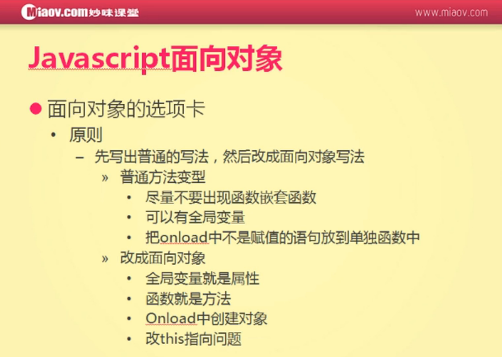

#传统的过程式编写选项卡




```
<style>
    #div1 div{ width: 200px; height: 200px; border: 1px #000 solid; display: none; }
    .active{ background: red; }
</style>

<script>
    window.onload = function(){
        var oParent = document.getElementById('div1');
        var aInput = oParent.getElementsByTagName('input');
        var aDiv = oParent.getElementsByTagName('div');

        for(var i=0; i<aInput.length; i++){
            aInput[i].index = i;
            aInput[i].onclick = function(){
                for(var j=0; j<aInput.length; j++){
                    aInput[j].className = '';
                    aDiv[j].style.display = 'none';
                }
                this.className = 'active';
                aDiv[this.index].style.display = 'block';
            };
        }
    };
</script>

<div id="div1">
    <input class="active" type="button" value="1">
    <input type="button" value="2">
    <input type="button" value="3">
    <div style="display: block;">111</div>
    <div>222</div>
    <div>333</div>
</div>
```

先变型：
尽量不要出现函数嵌套函数
可以有全局变量
```
var oParent = null;
var aInput = null;
var aDiv = null;

window.onload = function(){
    oParent = document.getElementById('div1');
    aInput = oParent.getElementsByTagName('input');
    aDiv = oParent.getElementsByTagName('div');

    for(var i=0; i<aInput.length; i++){
        aInput[i].index = i;
        aInput[i].onclick = change;
    }
};

function change(){
    for(var i=0; i<aInput.length; i++){
        aInput[i].className = '';
        aDiv[i].style.display = 'none';
    }
    this.className = 'active';
    aDiv[this.index].style.display = 'block';
}
```

把onload中不是赋值的语句放到单独的函数中
```
var oParent = null;
var aInput = null;
var aDiv = null;

window.onload = function(){
    oParent = document.getElementById('div1');
    aInput = oParent.getElementsByTagName('input');
    aDiv = oParent.getElementsByTagName('div');

    init();
};

function init(){
    for(var i=0; i<aInput.length; i++){
        aInput[i].index = i;
        aInput[i].onclick = change;
    }
}

function change(){
    for(var j=0; j<aInput.length; j++){
        aInput[j].className = '';
        aDiv[j].style.display = 'none';
    }
    this.className = 'active';
    aDiv[this.index].style.display = 'block';
}
```