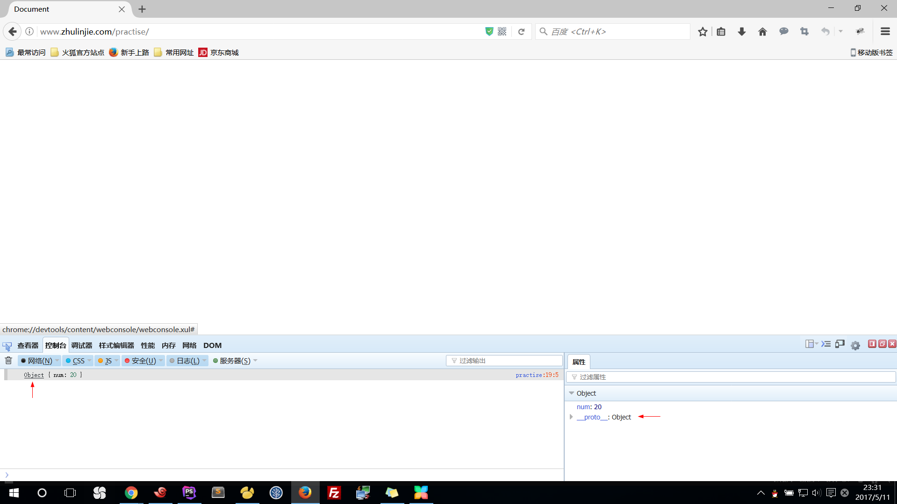
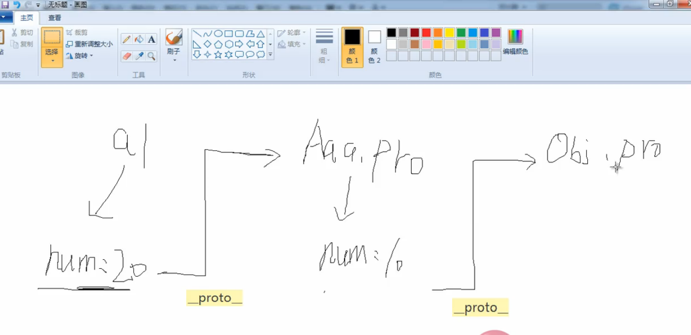

#JS面向对象及组件开发


###JS是基于原型的程序

自定义arr的push方法
```
<script>
var arr = [1,2,3];

Array.prototype.push = function(){
    for(var i=0; i<arguments.length; i++){
        this[this.length] = arguments[i];
    }
    return this.length;
};

arr.push(4,5,6);

alert(arr);
</script>
```

###什么是包装对象
```
var str = 'hello';
alert(typeof str);               // string
alert(str.charAt(0));           // h
alert(str.length);               // 5
```

为什么基本类型也有属性和方法？

这是因为有的基本类型拥有自己对应的包装对象，像上面的字符串类型对应的包装对象就是 String
```
var hello = new String('hello');
alert(typeof hello);              // object
alert(hello.charAt(0));           // h
// String.prototype.charAt = function(){};
```

再来看看下面发生了什么
```
var str = 'hello';                // 这里str确实是一个字符串类型
str.charAt(0);                    // 但是在这里，基本类型就会找到对应的包装对象类型，然后包装对象把所有的属性和方法给了基本类型，然后包装对象消失
```

给基本类型添加一个方法
```
var str = 'hello';
String.prototype.lastValue = function(){
    return this.charAt(this.length - 1);
};
alert(str.lastValue());     // o
```

一个小题目
```
var str = 'hello';
str.number = 10;
alert(str.number);      // undefined
```

###面向对象中的原型链

实例对象与原型之间的连接，叫做原型链
```
function Fun(){

}

Fun.prototype.num = 10;

var f1 = new Fun();
alert(f1.num);
```

思考为什么打印出来的是20
```
function Fun(){
    this.num = 20;
}

Fun.prototype.num = 10;

var f1 = new Fun();

// 通过console.log(f1) 可以查看原型链
console.log(f1);

alert(f1.num);          // 20
```

// 查看原型链





