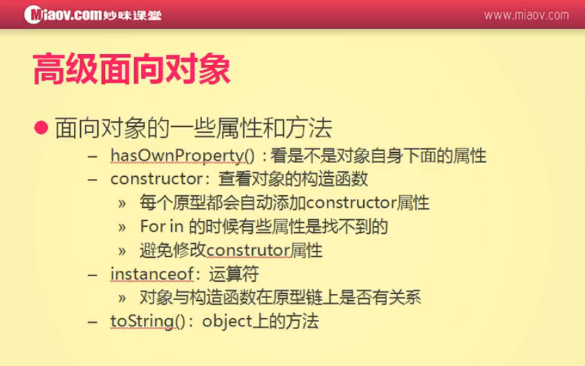

#hasOwnProperty和constructor的使用



hasOwnProperty 看是不是对象自身下面的属性
```
var arr = [];
arr.num = 10;
Array.prototype.num2 = 20;

alert( arr.hasOwnProperty('num') );     // true
alert( arr.hasOwnProperty('num2') );    // false
```

constructor：查看对象的构造函数
```
function Aaa(){

}
var a1 = new Aaa();
alert( a1.constructor );


var arr = [];
alert( arr.constructor );

alert( arr.constructor == Array );      // true
```

```
function Aaa(){

}
// Aaa.prototype.constructor = Aaa;        // 这句话是系统自动生成的，也是由系统生成的唯一的一句话
var a1 = new Aaa();
alert(a1.constructor);
```

```
function Aaa(){

}
// Aaa.prototype.constructor = Aaa;        // 每一个函数都会有的，都是系统自动生成的
Aaa.prototype.constructor = Array;         // 可以把它覆盖掉
var a1 = new Aaa();
alert(a1.constructor);
```

系统只会自动生成一个constructor，那hasOwnProperty又是从哪里来的呢
```
function Aaa(){

}
var a1 = new Aaa();
alert(a1.hasOwnProperty == Object.prototype.hasOwnProperty);    // true
```
这说明a1.hasOwnProperty中的hasOwnProperty方法是在Object对象下面的


